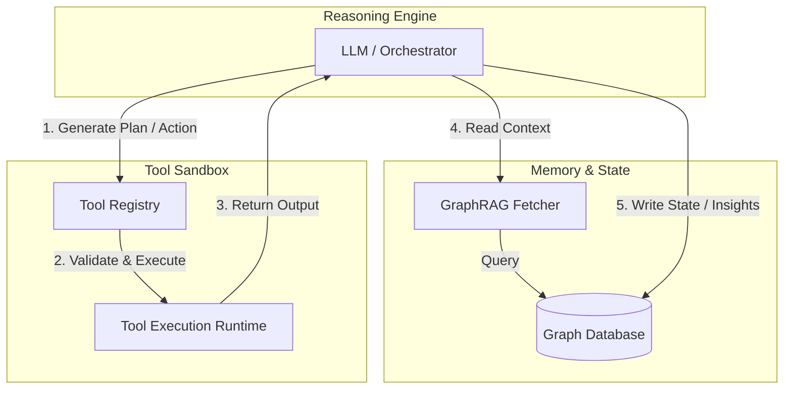

# ADR-001: Decoupling LLM Reasoning from Tool Execution and State Management

* **Status**: Accepted
* **Date**: 2026-05-22
* **Author(s)**: Sanket Muchhala
* **Deciders**: Sanket Muchhala

## Context and Problem Statement

Standard, single-prompt LLM scripts or naive agent loops typically couple the LLM prompt, tool logic, and state management into a single monolithic script. As system complexity grows, this approach runs into several critical limitations:
1. **Context Window Limitations**: Packing system prompts, historical conversation data, tool descriptions, and intermediate outputs into a single context window quickly hits token limits and degrades model performance (recall/attention degradation).
2. **Hallucination Loops**: When reasoning, tool execution, and state manipulation are tightly coupled, failures or unexpected outputs from tools often lead the agent into infinite recursive loops of hallucinations, as it lacks a clean circuit-breaker or structured state machine.
3. **Tight Coupling**: Embedding tool execution code or state retrieval mechanisms inside the orchestration logic makes the codebase brittle, hard to test, and difficult to scale with multiple specialized agents or changing tool sets.

## Decision Drivers

* **Maintainability & Testability**: The need to test reasoning logic, tool execution, and retrieval subsystems independently.
* **Context Efficiency**: Minimizing token consumption while maintaining deep relational context across steps.
* **System Resilience**: Preventing hallucination loops and ensuring deterministic boundaries for non-deterministic AI decisions.

## Decision

We are adopting a modular **ReAct (Reason + Act)** architecture that strictly decouples the LLM's reasoning engine from tool execution and state management.

Specifically:
1. **Separation of Orchestration and Execution**: The LLM will only act as the *reasoning and planning engine* (producing structured execution intents). An external runtime will parse these intents, execute the requested tools in an isolated environment, and feed the results back to the LLM.
2. **Strict Tool Registry**: Tools will be registered in a centralized, schema-validated repository. The LLM interacts with them via standardized interfaces and has no direct access to their implementation.
3. **Externalized State via GraphRAG**: Agent memory and execution state will be offloaded to a persistent Graph Database. Instead of appending full history to the prompt, we will query the graph using GraphRAG patterns to inject only the relevant sub-graph context.

## Consequences

* **Positive / Benefits**:
  * **Scalability**: New tools can be added to the registry without touching the orchestrator prompt or logic.
  * **Token Efficiency**: GraphRAG fetches precise sub-graphs, avoiding bloated context windows and high token costs.
  * **Debuggability**: Tool failures can be isolated, logged, and mocked, enabling unit testing of reasoning loops.
  * **Resilience**: The host application can intercept loop states or tool exceptions, enforcing hard circuit-breakers to stop hallucination loops.

* **Negative / Trade-offs**:
  * **Increased Latency**: Running multiple, sequential LLM reasoning steps coupled with graph queries and tool execution calls significantly increases end-to-end user latency.
  * **Deterministic vs. Probabilistic**: Handling the transition between the LLM's probabilistic plans and the tool registry's deterministic code execution adds development overhead.
  * **System Complexity**: Developing, maintaining, and synchronizing a Graph Database schema alongside the LLM prompt templates and tool schemas requires higher engineering effort.

## References

* [README.md](../../README.md)
